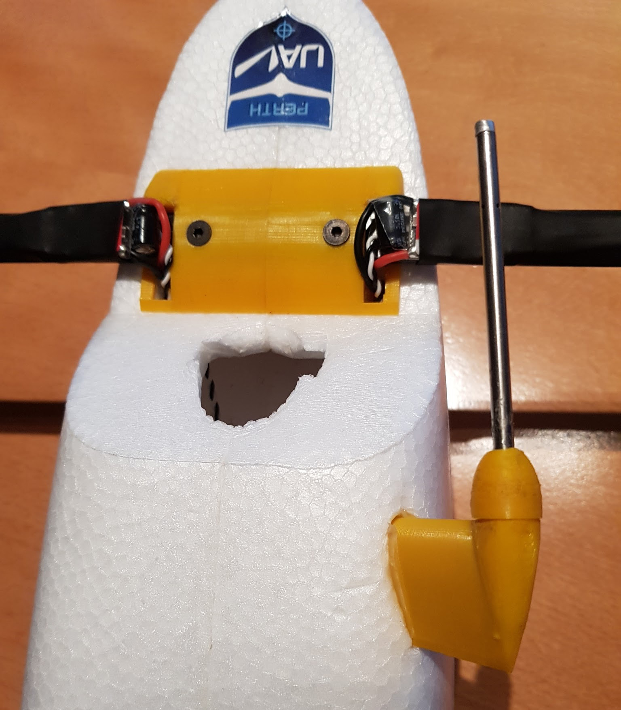
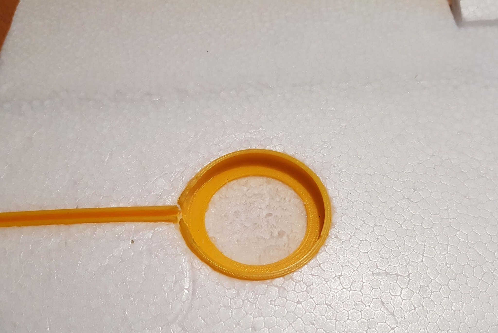
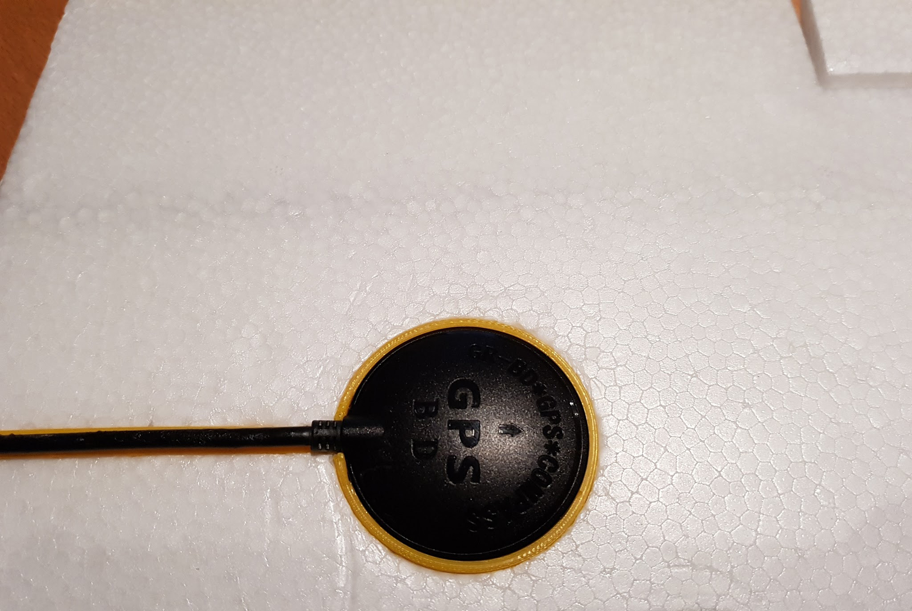
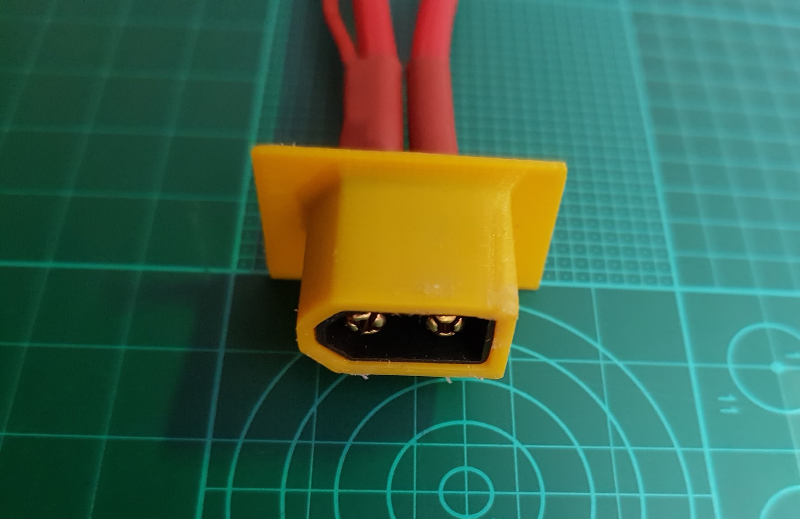

Sensors and Accessories
=======================

Pitot Tube and Airspeed Sensor
..................................

For any quadplane, the placement and performance of the pitot tube and air speed sensor is important for smooth transitions and flight control.
The airspeed sensor is mounted in the avionics enclosure and connected via the I2C bus to the flight controller.

The pitot tube 3D mount can be found on Thingiverse here: https://www.thingiverse.com/thing:169317

.. Tip::
  Prior to mounting the pitot tube, ensure the 3D printed parts screw together and there is enough clearance for the pitot tube and rubber hoses to fit through the print.

In order to work accurately, the pitot tube must be mounted in a position where it is exposed to laminar and not turbulent airflow.
It should not be placed behind or too close to any wings or other parts of the aircraft.
Also make sure the air hoses can be routed cleanly, without being bent or clamped, to the airspeed sensor on the inside of the fuselage.
Use the pitot riser or the template to mark and cutout the foam in the location that the pitot will be attached to the fuselage.

First, insert the pitot tube into the 3D printed screw cap and then connect the air hoses to the pitot tube and route, then through the pitot mount riser.
Carefully insert the pitot tube and air hoses into the 3D printed pitot riser, making sure that they are not damaged or kinked, and then screw the cap onto the riser.
Check to see that the pitot tube and hoses work correctly by blowing into the hose ends and seeing if air comes out of the pitot tube holes.
Insert the air hoses through the cutout in the foam and glue the riser in place, ensuring the pitot tube is oriented directly forwards into the airflow.

GPS
......

The GPS is a very sensitive RF antenna that is prone to radio and electromagnetic interference of nearby electronics and transmitters.
Because the Mozzie is a fairly small airframe, it is somewhat difficult to keep the GPS isolated from such interference by maintaining enough separation from the source.
For this reason, we have opted to mount the GPS on the left wing, which requires it to be removed and attached with the main wing.
The GPS can be unclipped from the 3D printed mount and the cable can remain connected to the FC for transport with the wing removed, however,
make sure the GPS is placed in the fuselage for transport so the GPS cable is not damaged.

To mount the GPS, first use the GPS M8 Mount and Conduit 3D print to mark the position of them on the wing, making sure the GPS cable is long enough to reach that location with no tension on the connector,
and avoiding any other structures in the wing like cables and spars.
Then cut out the foam to recess the GPS mount and cable conduit into the wing so the top of the 3D GPS Mount and Conduit is flush with the top of the wing foam.
Dry fit all the parts, including the GPS module and cable, to make sure they fit and then glue into the wing.

When assembling the aircraft, clip the GPS module and cable into the relevant 3D printed parts in the wing and make sure they are not loose when fitted,
and that the cable does not get damaged when inserting or removing the GPS module. Trim and adjust the parts as required.
It is also possible to use copper tape underneath the GPS on the wing or inside the fuselage to reduce interference further.

Antennas
..........

Depending on the final configuration and the hardware used, there are various placement options for the antennas on the aircraft.

RC Receiver
^^^^^^^^^^^^
When the FrSky RC receiver is mounted in the avionics enclosure, the antennas can be mounted on the enclosure itself by inserting the antenna cables through the two angled slots on the front of the avionics enclosure RFD/Air (top).
In this location, the Frsky range is typically enough for line of sight operations up to 1-2km, which should suffice for most operations.
It's unlikely that any extra range is required as it is not possible to physically see the orientation and fly the Mozzie from that distance.

Wifi (WLAN)
^^^^^^^^^^^

The Pi Zero W wifi antenna is mounted on the Pi PCB so its position can't be changed. Its range is unlikely to exceed 100-150m outdoors so it is not very useful for in flight wifi connectivity.
Connecting an external USB wifi module will perform better, and ranges of multiple kilometers are possible using the right hardware and antennas.
Having in flight wifi connectivity might also be useful to use to download images or for short range telemetry, should any of the other primary connectivity systems like 3G/4G mobile data or RFD900 telemetry fail in flight,
as it allows connectivity without requiring the landing of the aircraft.

.. Tip::
   It is possible that the wifi will interfere with the FrSky RC signal as they can operate on the same 2.4Ghz frequencies. If possible, use a 5.8Ghz wifi USB module.

RFD900x Telemetry
^^^^^^^^^^^^^^^^^^

The RFD900 is the primary RF telemetry connection on the Mozzie platform and, in the case of the RFD900x, can also provide manual RC control of the Mozzie as well.
Accordingly, the RFD900x is the second most important RF hardware on the aircraft, following closely after the GPS module,
so antenna placement can be critical in achieving the required range and performance.
Being a small airframe, positioning the antennas with enough separation and the correct orientation can be difficult.

We have opted to mount both the foil antennas on the foam V-tail of the Mozzie as these surfaces are mostly RF transparent and the antenna cables can be conveniently connected directly to the RFD900x on the avionics enclosure.
The antenna orientation also allows for good ground coverage, which is not typically sensitive to aircraft heading changes.

.. Tip::
   It is advisable to test the long range performance of the RFD900x by using a separate ground team at a remote location,
   while another local ground crew can fly and observe the Mozzie directly overhead and be ready to use the RC to take control should the aircraft loose telemetry.
   Note: For this to work reliably the FrSky receiver must be installed in the Mozzie.

3G/4G Mobile External Antenna
^^^^^^^^^^^^^^^^^^^^^^^^^^^^^^^^

If using a USB mobile data modem, placement of the antenna in flight is likely to be less critical than when it is operating on the ground.
3G/4G mobile reception on the ground is not very good if the antenna is less than 500mm from the ground.
Due to the compact nature of the Mozzie, it is only some 250mm high overall, so it's not possible to mount a mobile antenna on the Mozzie that will work effectively on the ground;
however, it should perform quite well whilst in flight if it is placed in the front nose of the aircraft, in front of the battery.

LED Status Strip
...................

The LED bar shows the current status of the Flight Controller (Pixhawk) as follows:
 * Green is disarmed
 * Red is armed
 * Slow pulsing shows the flight controller heartbeat (which also indicates that the CC has booted correctly and that mavproxy is forwarding mavlink messages from the FC).

Power Key
............

One of the rule requirements is to provide a method to remove all power to the propulsion system.
For this we are using a simple XT60 plug that is inserted into Power Loom to close the circuit and power up the propulsion.

.. Tip::
  If the wiring is configured as per the Power Loom diagram, only the power for the propulsion is disabled if the power key is removed and the avionics and UBEC's will continue to be powered by the battery.
  Disconnecting the battery will completely un-power all the aircraft systems, but it is advisable to unplug the power key every time work is to be done on the aircraft for safety reasons, because the propellers and motors will be disabled.
  Running the aircraft without the power key is also convenient for bench testing and configuring the avionics before flight.

To install the Power Key 3D print, use it to score and mark the position you would like to install the key on the fuselage, making sure that the power loom cable can reach that location and the 3D print can fit against the foam smoothly.
Cut out the foam smaller than the 3D print so that the print fits snuggly into the fuselage.
Find the correct XT60 connector of the power loom, where the power key is meant to be inserted, and glue that XT60 into the Power Key 3D print, making sure the glue does not block the connector.
Wait until the glue sets and then glue the 3D print into the foam fuselage cutout.

.. Note::
  To comply with the rules, note colour standards required for showing the propulsion power state on the power key connector.

Safety Switch
................

To install the Safety Switch into the fuselage, find a location on the fuselage that gives you safe access to the safety switch away from the propellers
and is also within reach of the cable length of the safety switch.
Then carefully mark that location and cut out the fuselage foam with a hobby knife to a diameter that is smaller than the Safety Switch 3D print, so it fits snuggly into the foam.

.. Tip::
  It is advisable to avoid mounting the switch in the foam lid, as the safety switch wire will fatigue and break over time, and also impair access to the inside of the airframe for placing the battery etc.
  Like with the sample vial tube, it is possible to cut a section and permanently attach some of the foam lid to the fuselage and attach it on that instead.

Glue the Safety Switch 3D print into the hole and wait for it to set. Insert the cable of the Safety Switch through the 3D print and carefully route it to the FC and connect it to the Switch connector.

.. image:: images/AE/SafetySwitch_SM.jpg
      :target: images/AE/SafetySwitch.jpg

Sample Vial
.............

For the blood sample, the challenge rules require a tube 100mm long and 20mm wide. The blood sample itself is in fact much smaller than this, and can withstand some impact in itself without breaking.
We used a Berocca tube (similar to a Smarties tube) with about the right dimensions, but any lightweight tube of similar dimensions should suffice to contain the sample.
Adding extra padding to reduce the likelihood of breaking the vial is optional.

.. image:: images/SampleTube_SM.jpg
      :target: images/SampleTube.jpg

First cut the Berocca tube to the right length so that it just clears the height of the foam lid whilst standing on the 3D printed cap. This should be about XXmm long.
It can also be partially recessed into the foam lid to make it more streamlined; however, ensure that it is easy to both remove the Berocca tube cap and that it secures properly, to avoid the sample falling out.
Then insert the cut end of the Berocca tube through the center hole of the Talon Box Bridge and score and cut the fuselage foam so that the Berocca tube will sit level on the fuselage floor when mounted.

Then, whilst the tube is still inserted through the Talon Box Bridge, glue the 3D printed cap to the cut end of the Berocca tube and, subsequently, to the floor of the fuselage.
If required, it is possible to segment the foam fuselage lid and permanently attach those foam parts with glue or tape to the fuselage to accommodate the vial holder tube better.

Cable Management
..................

It's good practice to ensure that all the cables, connectors and any penetrations where cables go through hard materials are managed
by ensuring they are not tensioned, cut, clamped, bent or excessively fatigued through movement.
By adding some cable ties, cable clips and spiral cable wrap, the overall presentation and routing of cables can be improved and protected.
This also helps greatly when trying to diagnose hardware or wiring issues, as well as making sure that everything is connected the way it should be when doing pre-flight checks.
