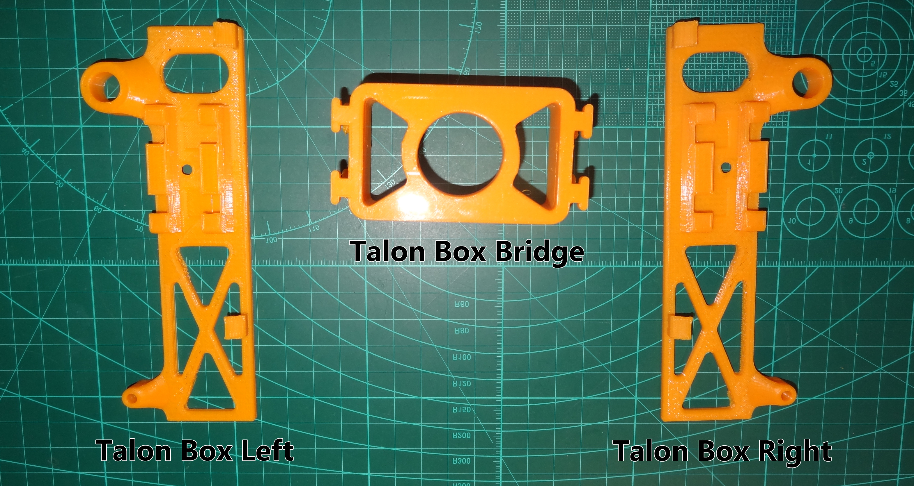
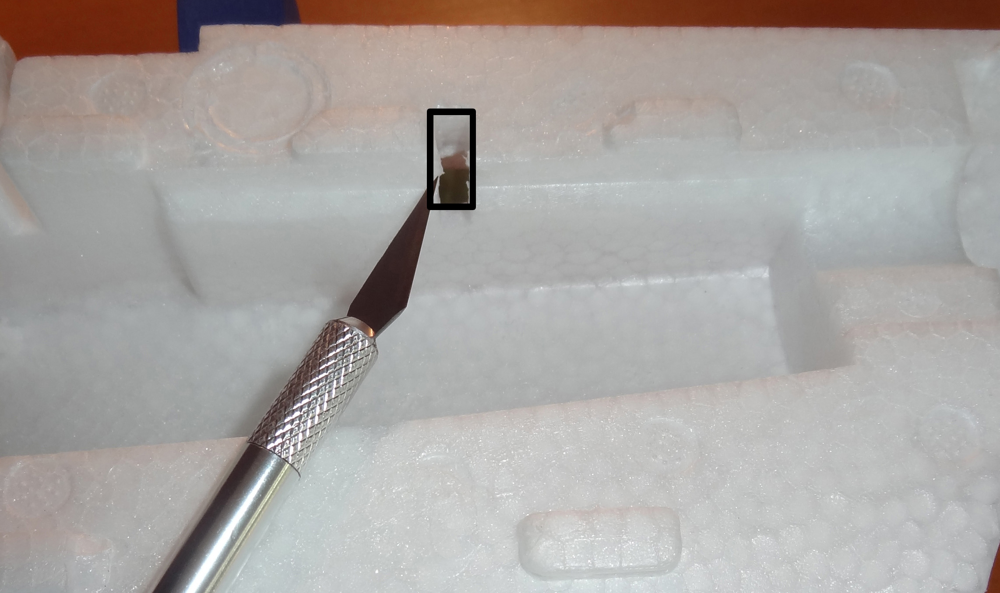
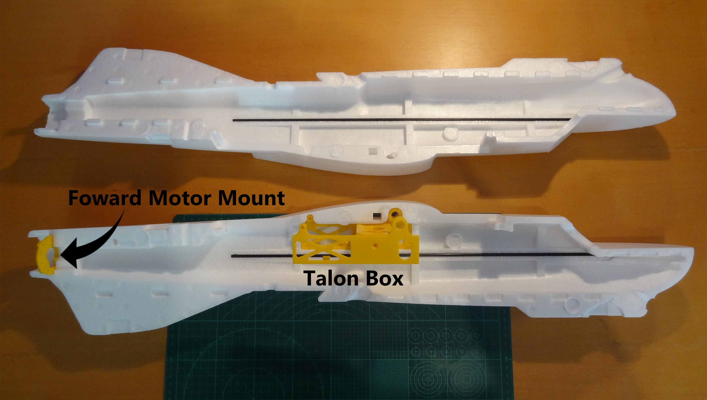
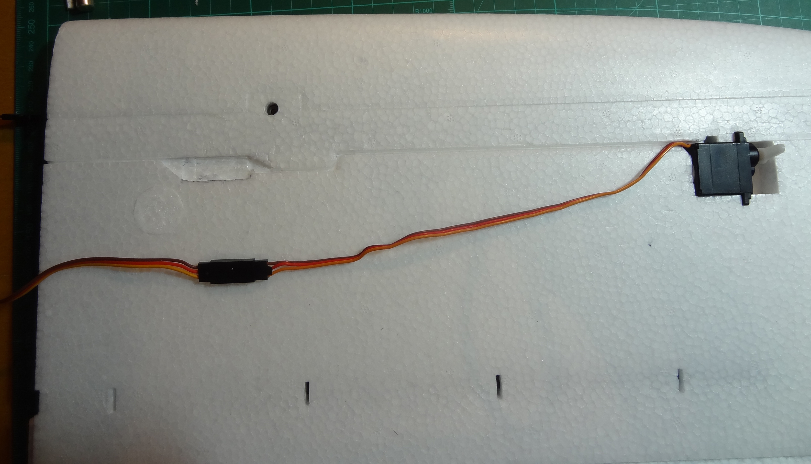
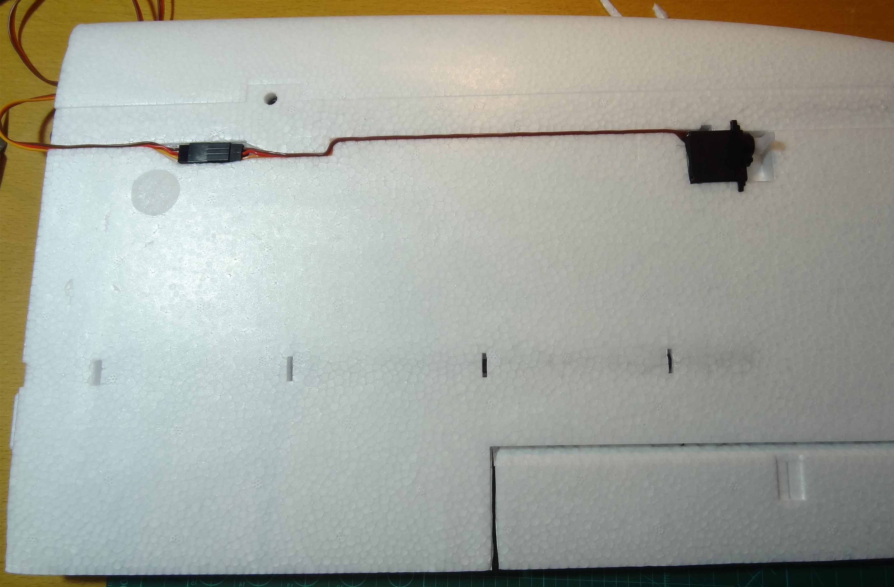

Airframe
=================

Fuselage
---------

Step 1 - Assembling the 3D Printed Fuselage Frame
..................................................

3D Parts Required:
  - Talon Box Bridge
  - Talon Box Left Side
  - Talon Box Right Side

.. Tip::
    Not all 3D parts come off the printer in perfect condition. Before assembling any 3D printed parts,
    or gluing any 3D printed parts ensure that the parts all fit together by carefully removing any excess plastic from the print and seeing if they dry fit together first!

Line up the dovetails and slide the Right and Left side parts into the Box Bridge as shown.
Be careful to ensure the connection points don't have any excess plastic or contortions and will slide together cleanly.
The Bridge and Sides are meant to be flush across the top otherwise the foam lid may not fit.

Note that it may take some force to slide the parts together and they will be difficult to separate afterwards because the print layers will bind the parts.
This is intentional so parts do not need to be glued together.

.. image:: images/Fuselage/TalonBoxAssembled.jpg
    :target: images/Fuselage/TalonBoxAssembled.jpg

.. Tip::
  Use a 80-200 grit sandpaper to key the surfaces of the 3D printed parts (make it rough) that will come in contact with the foam when assembled.
  This will ensure a proper bond with UHU glue and the hard, sometimes very smooth and shiny plastic surface.

Step 2 - Assembling the Fuselage
..................................

.. image:: images/Fuselage/TalonBoxInFuselageParts.jpg
    :target: images/Fuselage/TalonBoxInFuselageParts.jpg

.. Tip::
  It's generally good practice when assembling a model to check that all the supplied parts fit together before gluing it.
  Whilst examining the parts remove any excess foam or material left over from the manufacturing process.
  It's also a good opportunity to see if you have all the parts you require to complete the build step you attempting, and lay them and any tools you need out in preparation for assembly.

Cut out the foam with the hobby knife as shown on both pieces of the fuselage foam so that the tail servo cables can fit through the opening easily.

Dry fit the fuselage sides to check that they fit well together, and do not have any excess foam that prevents them from connecting completely.
Then try to dry fit the 3D printed Box assembly inside the fuselage halves as shown. Note the CF spar openings in the foam must be clear and be aligned with the holes in the 3D print.

.. image:: images/Fuselage/ForwardMotorMountInstall.jpg
    :target: images/Fuselage/ForwardMotorMountInstall.jpg

Insert the 3D printed Forward Motor Mount as shown, with the key hole pointing towards the bottom rudder wing.
This needs to be pointing the correct way to ensure the motor cables can be routed through the motor mount afterwards.

.. image:: images/Fuselage/TalonFuselageGlue.jpg
    :target: images/Fuselage/TalonFuselageGlue.jpg

Once you are comfortable that all the parts fit together without glue then glue one side of the Talon Box into the fuselage as well as the Forward Motor Mount (check the orientation!).
The carefully run a bead of glue around the entire perimeter of the fuselage and over the area of the rear rudder, and the other side of the Talon Box plastic.
Carefully place the other fuselage over the 3D printed parts, check alignment of the parts, and press the two halves together firmly.
Whilst holding the halves together use some tape to wrap around the fuselage to keep it firmly together while the glue sets over a few hours or overnight.

.. image:: images/Fuselage/GluedFuselage.jpg
    :target: images/Fuselage/GluedFuselage.jpg

Make sure the rear motor mount is aligned, and the rudder halves and fuselage are glued and taped together to form one seamless piece.

.. image:: images/Fuselage/FuselageTape.jpg
    :target: images/Fuselage/FuselageTape.jpg

Wings
------

Step 1 - Parts Preparation
...............................

.. image:: images/Wings/ServoCentreLockTight.jpg
    :target:  images/Wings/ServoCentreLockTight.jpg

Use a servo tester to find the middle position of the servo, attach the horn at 90degrees corresponding to the wing or tail it will be used in.
Use a very small drop Loctite to secure the servo horn screw into the servo. Repeat this for all the wing and tail servos (4x).

.. image:: images/Wings/WingServoCut.jpg
    :target:  images/Wings/WingServoCut.jpg

**Do the following for both wings:**

To place the servos the wing and tail cutouts, they need to be cut out to make them fit.
Place the servo over the wing cutout for the servo and mark the servo size using a marker.
Carefully cut it out with a sharp hobby knife so that the servo fit's snugly into the foam.

.. tip::

  (Use the marker to put a line on the hobby knife blade to the cut depth required)

To insert the cable into the wing foam seam use the hobby knife to cut along the seam at a depth of 5-6mm.
Insert the Servo into the servo cutout and place the servo cable along the wing seam to find the location that the servo plug needs to be recessed into the wing and mark it.
Then cut it out to a depth of about 3mm, using multiple cuts at that depth to easily remove the foam.

Step 2 - Assembling the Wing
...............................

.. Tip::
  Use a 80-200 grit sandpaper to key the surfaces of the servo (make it rough) that will come in contact with the foam.
  This will ensure a proper bond with hot glue or glue and the hard, sometimes very smooth and shiny plastic surface.

Then use hot glue on the base and around the servo sides under the tabs to glue it into the foam recess. Try to make sure the servo is straight and flush with the wing surface.
Remove excess hot glue, preferably before it cools completely. Then insert the cable into the wing seam until flush.
To secure the servo cable and connector use a piece of tape over the entire length from the servo to the end of the wing.

Step 3 - Assembling the Tail Wing
....................................

.. image:: images/Wings/TailServoCut.jpg
    :target:  images/Wings/TailServoCut.jpg

Place the servo over the tail wing recess, mark and cutout the recess to make the servo fit snug in the tail wing.

.. image:: images/Wings/TailServoInstalled.jpg
    :target:  images/Wings/TailServoInstalled.jpg

Slide the servo cable into the provided gap.
To secure the servos use a piece of tape on either side of the servo making sure a gap remains to allow movement of the servo horn.

.. image:: images/Wings/ControlHorns.jpg
    :target:  images/Wings/ControlHorns.jpg

After keying the control horns with sandpaper glue them into the provided recesses with the holes of the horn facing the servo.
Attach the control rod and hardware as shown, however do not yet use Loctite to secure the control rod screw until the Full System Check has been completed.
