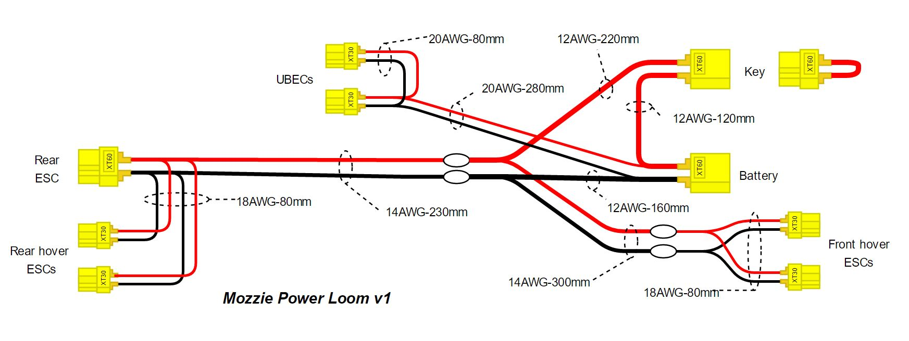

Power Loom
----------

To construct the power loom you will require the following components:

 * 2x Male and 2x Female XT60 connectors
 * 6x Male XT30
 * 20AWG cable cut to 1 set Black+Red 80mm long and 1 set of Black+Red 280mm long
 * 18AWG cable cut to 3 sets of Black+Red cables 80mm long
 * 14AWG cable cut to 1 set of Black+Red cables 530mm long
 * 12AWG cable cut to 1 Black cable 160mm long, 1x Red cable 120mm long, and 1x Red 220mm long and 1x 30mm long for the key

.. Note::
   The power loom has been designed to minimize the use of XT60 connectors and reduce the wiring required to a minimum.
   It also allows for easy replacement of the various ESC, UBEC components and to allow for diagnostic capability.
   When removed the XT60 key is designed to only disable the propulsion system, however the UBEC and avionics will remain powered on.
   Remove the battery from the power loom to disable the whole system.

Start the power loom by first soldering all the XT30 connectors onto their respective cables as per the diagram above.

.. Tip::
   Before soldering a wire to a connector, strip just enough insulation from the cable to fit the connector you are using. Make sure to use heatshrink
   to protect the back of the connectors and solder joints, and remember place the heatshrink over the cable before soldering.

Then mark the length of the main 14AWG cable at 230mm from the rear ESC XT60 and carefully use the hobby knife to remove about 20mm of silicone insulation from that location,
without cutting or damaging the copper wire itself.
Then strip about 20mm of insulation from the end of the correct 12AWG cables and carefully wrap the wire around the gap in insulation on the 14AWG cable, solder in place and heatshrink.
Do this for the red and black cables.

Then add heatshrink to the cables and proceed with soldering the XT60 connectors on their respective cable ends and ensuring that the polarities of the connectors and cable colors match the diagram.

Finally attach the main 14AWG cable along the bottom right side of the fuselage with cable clips making sure the front and rear XT30 and XT60 connectors reach their respective ESC connectors.

.. DANGER::
   When working on the airframe always remove the key from the airframe to disable the propulsion and make it safe!
   All the propellers present significant laceration risk, which can require stitches, hospital and even surgery.
   Never work on the airframe with a battery connected, without all the propellers and/or the key removed!

.. Warning::
   Do not connect a 3DR power module (with current sensing shunt) between the battery and the battery connector on the power loom!
   Most power modules are only rated for 90A and do not support the power capacity required to fly the Mozzie, which can be in excess of 150A in transition!
   To avoid any brownouts and in flight failures that will result in a crash, simply connect the power module between the rear ESC XT60 and the forward motor ESC.
   This is the only place current monitoring is really required as most of flight will the forward motor only.
   Battery voltage will still be indicated by the power module.
