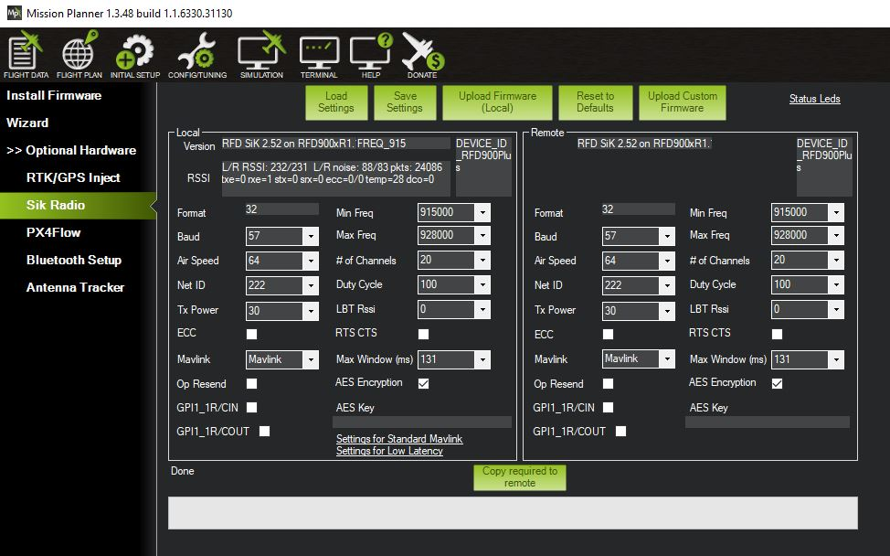

RFD900x Setup
==============

.. todo::
   image:: /images/RFD900x/RFD900x.jpg

.. Warning::
  These modems are high-power RF devices and it is recommended to power these devices from a separate power supply and not directly from the Flight Controller.

.. Note::
  As described previously in the RC Setup page there are two ways to connect the RC to the Mozzie. Please see there for details.

Connecting the Radio to the Pixhawk
......................................

.. todo::
   image:: /images/RFD900x/RFD900xWiring

   image:: /images/RFD900x/RFD_Pins.jpg

Connecting the Radio to Computer
......................................
Connect RX to RFD900x using x cable.
Power from USB? Should have own power because USB ain't enough.

Radio Configuration using Mission Planner
...........................................

.. Warning::
  These settings are the recommended settings for Australia and for the competition. However it is solely the users responsibility to ensure the settings comply with their countries regulations and with the competition rules, should there be any differences.

PPM Setup in the Mozzie

Configure the RFD900X Settings using Mission Planner:
TO configure

Encryption
............

To use or not to use?

Manuals
...........

`RFD900x Manual <http://files.rfdesign.com.au/Files/documents/RFD900x%20DataSheet.pdf>`_

`Software Manual PtP <http://files.rfdesign.com.au/Files/documents/RFD900x%20Peer-to-peer%20User%20Manual.pdf>`_
